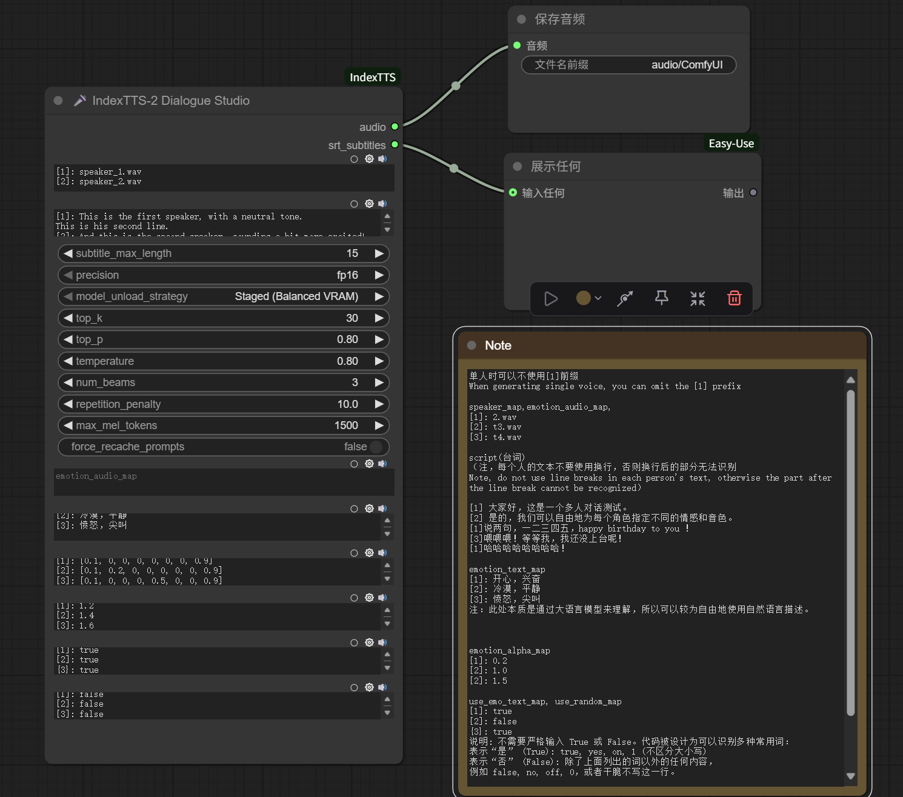

[中文版说明](README-zh.md)

# ComfyUI IndexTTS2

This is a modified ComfyUI IndexTTS2 node based on [ComfyUI_IndexTTS](https://github.com/billwuhao/ComfyUI_IndexTTS), enabling multi-person speech generation without limiting the number of speakers.

This version supports the latest `transformers==4.38.2`, provides more flexible model management, and can run on devices with as little as 6GB of VRAM.

## Model Paths & Dependency Installation

For instructions on configuring model paths, setting audio paths, and installing special dependencies, please refer to the documentation of the original project [ComfyUI_IndexTTS](https://github.com/billwuhao/ComfyUI_IndexTTS).

**Please don't forget to give the original project [ComfyUI_IndexTTS](https://github.com/billwuhao/ComfyUI_IndexTTS) a star!**

## How to Use

Multi-person speech generation is achieved through multi-line text input, where each line represents the audio, script, and related parameters for one speaker.

For detailed usage instructions and parameter configurations, please refer to the example workflow file [indextts2.json](workflow-examples/indextts2.json) included in the project, which contains detailed comments and node explanations.

### Workflow Example

